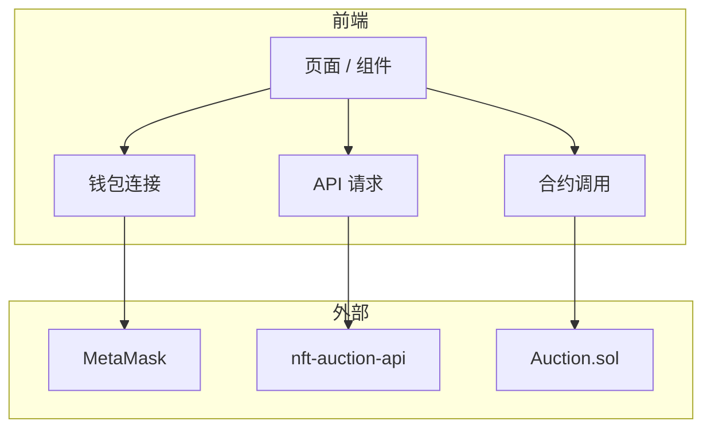
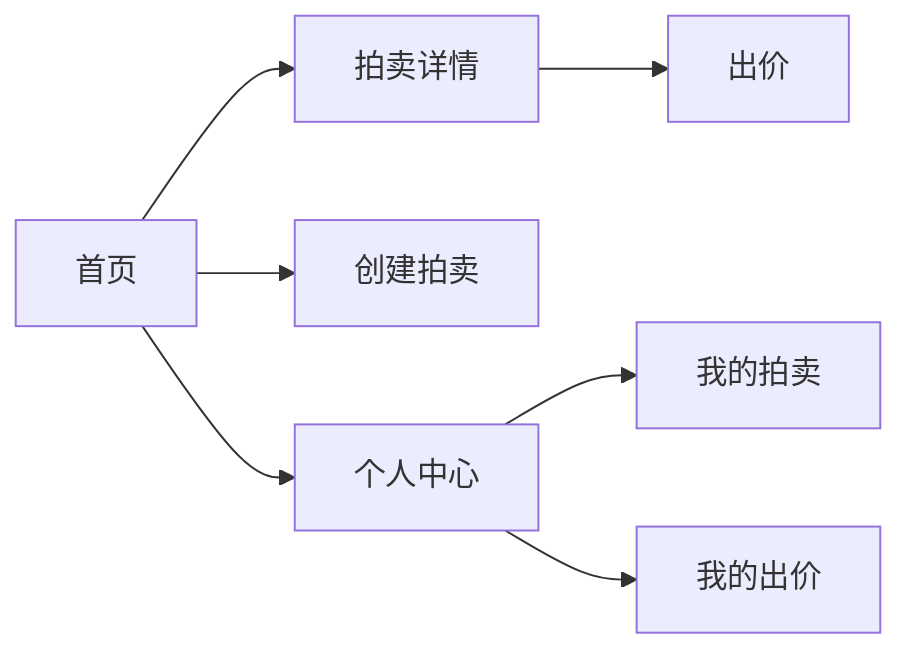
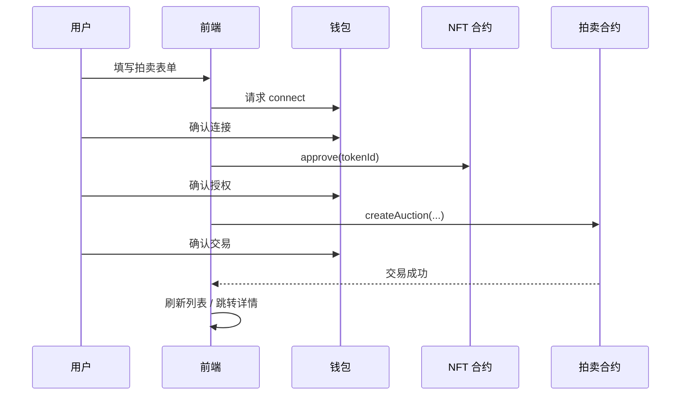
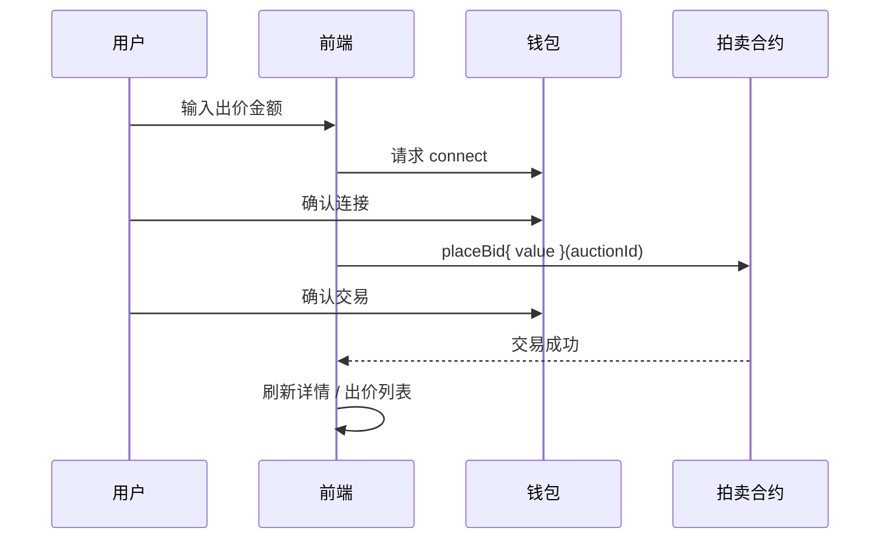

# NFT Auction Web 前端架构设计文档

> 基于 [nft-auction](/home/cjq_ubuntu/web3/projects/nft-auction) 智能合约与 [nft-auction-api](/home/cjq_ubuntu/web3/projects/nft-auction-api) 后端的 Web 前端设计规范。

---

## 一、项目概述

### 1.1 项目名称

**NFT Auction Web**

### 1.2 定位

NFT 拍卖市场的 Web 前端，实现：

- **钱包连接**：MetaMask / WalletConnect 等
- **链上写操作**：创建拍卖、出价、结束/取消拍卖（直接调用合约）
- **数据展示**：通过 API 获取拍卖列表、详情、出价记录
- **用户认证**：账号注册/登录，与钱包地址绑定

### 1.3 技术栈建议

| 技术 | 说明 |
|------|------|
| React | 18+ |
| TypeScript | 类型安全 |
| Vite | 构建工具 |
| wagmi | React Hooks for Ethereum |
| viem | 轻量以太坊交互 |
| TanStack Query | 服务端状态 / API 缓存 |
| React Router | 路由 |
| Tailwind CSS | 样式 |

### 1.4 数据流与职责



- **读数据**：调用 API（拍卖列表、详情、NFT 元数据等）
- **写链上**：通过钱包签名，调用合约（createAuction、placeBid、endAuction 等）

---

## 二、页面结构

### 2.1 路由设计

| 路径 | 页面 | 说明 |
|------|------|------|
| / | 首页 | 拍卖列表 |
| /auctions/:id | 拍卖详情 | 详情 + 出价 |
| /auctions/create | 创建拍卖 | 需登录 + 钱包 |
| /profile | 个人中心 | 我的拍卖、出价 |
| /login | 登录 | 账号登录 |
| /register | 注册 | 账号注册 |

### 2.2 页面流程图



---

## 三、与 API 的集成

### 3.1 API 基础配置

```
VITE_API_BASE_URL=http://localhost:9080
```

### 3.2 主要 API 调用

| 接口 | 用途 |
|------|------|
| GET /api/auctions | 拍卖列表（分页、status） |
| GET /api/auctions/:id | 拍卖详情 |
| GET /api/auctions/:id/bids | 出价列表 |
| POST /api/auth/register | 注册 |
| POST /api/auth/login | 登录 |
| GET /api/users/me | 当前用户（需 JWT） |
| GET /api/users/:address/auctions | 某地址的拍卖 |

### 3.3 认证

- 登录后保存 JWT 到 localStorage 或内存
- 请求头：`Authorization: Bearer <token>`

---

## 四、与合约的集成

### 4.1 合约地址配置

```
VITE_AUCTION_CONTRACT_ADDRESS=0x...
VITE_NFT_CONTRACT_ADDRESS=0x...
VITE_CHAIN_ID=11155111
```

### 4.2 主要合约调用

| 合约方法 | 前端场景 |
|----------|----------|
| createAuction(nftContract, tokenId, duration, minBidUSD, paymentToken) | 创建拍卖 |
| placeBid(auctionId) | ETH 出价 |
| placeBidWithToken(auctionId, amount) | ERC20 出价 |
| endAuction(auctionId) | 结束拍卖 |
| cancelAuction(auctionId) | 取消拍卖 |
| approve(auctionContract, tokenId) | 授权 NFT 给拍卖合约 |
| approve(auctionContract, amount) | 授权 ERC20 给拍卖合约 |

### 4.3 调用前准备

1. **创建拍卖**：先 `approve` NFT，再 `createAuction`
2. **ETH 出价**：`placeBid{ value: amount }(auctionId)`
3. **ERC20 出价**：先 `approve` 代币，再 `placeBidWithToken`

---

## 五、目录结构建议

```
nft-auction-web/
├── src/
│   ├── api/              # API 请求封装
│   │   ├── client.ts
│   │   ├── auction.ts
│   │   └── auth.ts
│   ├── contracts/        # 合约 ABI、地址
│   │   ├── abi.ts
│   │   └── addresses.ts
│   ├── hooks/            # 自定义 Hooks
│   │   ├── useAuction.ts
│   │   ├── useBid.ts
│   │   └── useAuth.ts
│   ├── components/
│   │   ├── common/
│   │   ├── auction/
│   │   └── layout/
│   ├── pages/
│   │   ├── Home.tsx
│   │   ├── AuctionDetail.tsx
│   │   ├── CreateAuction.tsx
│   │   └── Profile.tsx
│   ├── store/            # 全局状态（可选）
│   ├── utils/
│   ├── App.tsx
│   └── main.tsx
├── public/
├── docs/
│   └── ARCHITECTURE.md
├── package.json
├── vite.config.ts
├── tailwind.config.js
└── tsconfig.json
```

---

## 六、核心功能流程

### 6.1 创建拍卖



### 6.2 出价（ETH）



### 6.3 数据获取

- 拍卖列表、详情：优先从 API 获取（含链下索引、NFT 元数据）
- 链上确认：交易成功后轮询或监听事件，必要时刷新 API 数据

---

## 七、环境配置

```env
# API
VITE_API_BASE_URL=http://localhost:9080

# 合约（Sepolia 示例）
VITE_CHAIN_ID=11155111
VITE_AUCTION_CONTRACT_ADDRESS=0x...
VITE_NFT_CONTRACT_ADDRESS=0x...

# 可选：WalletConnect / Infura 等
VITE_WALLETCONNECT_PROJECT_ID=
```

---

## 八、错误处理

| 场景 | 处理方式 |
|------|----------|
| 未安装钱包 | 提示安装 MetaMask |
| 未连接钱包 | 显示「连接钱包」按钮 |
| 网络错误 | 提示切换网络（如 Sepolia） |
| 交易拒绝 | 提示用户已取消 |
| 交易失败 | 展示 revert 原因 |
| API 错误 | 展示错误信息、重试 |

---

## 九、与相关项目交叉引用

| 项目 | 路径 | 说明 |
|------|------|------|
| 智能合约 | /home/cjq_ubuntu/web3/projects/nft-auction | IAuction 接口 |
| 后端 API | /home/cjq_ubuntu/web3/projects/nft-auction-api | REST 接口 |

---

## 十、待实现清单

- [x] 初始化 Vite + React + TypeScript 项目
- [x] 配置 wagmi + viem
- [x] 实现钱包连接组件
- [x] 实现 API 客户端与请求封装
- [x] 实现拍卖列表、详情页
- [x] 实现创建拍卖流程
- [x] 实现出价流程（ETH / ERC20）
- [x] 实现用户注册、登录
- [x] 实现个人中心
- [ ] 接入 NFT 元数据展示（含 IPFS 等）
